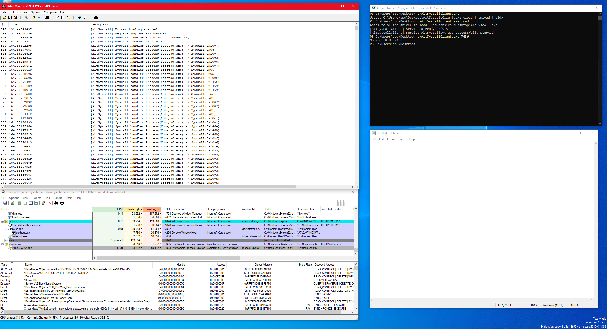

# WinAltSyscallHandler
Some research on AltSystemCallHandlers functionality in Windows 10 20H1 18999

----------------------------------------------------------------------------

`PsAltSystemCallHandlers` is an array of 2 members.
We cannot change the first member using `PsRegisterAltSystemCallHandler` because it checks for the index value. First member is reserved for `Pico` processes.
Also, if second member was already initialized, expect a bug check - 0x1e0. 

First member is initialized to `PsPicoAltSystemCallDispatch` in `IoInitSystemPreDrivers`.
The second member can be a pointer to a function, but also a value like 0 or 1.
The value 1 is present when initialized by `PsNotifyCoreDriversInitialized` and it will not be possible to enable system call handling because `PspEnableAltSystemCallHandling` will return `STATUS_UNSUCCESSFUL` and 0 is the default value.

In `PsAltSystemCallDispatch` the handler is called based on the value from `KeGetCurrentThread()->Header.DebugActive`. If it has the 3rd bit (`DebugActive.Minimal`) set to 1, then the first handler is called (`PsPicoAltSystemCallDispatch`).
Otherwise if the the 6th bit (`DebugActive.AltSyscall`) is set to 1, then the second handler is called (The one we can register with `PsRegisterAltSystemCallHandler`). In any other case the kernel will crash with bug check = 0x1e0.

`PsAltSystemCallDispatch` is called from `KiSystemCall64`. We determined that the argument to `PsAltSystemCallDispatch` is the `KTRAP_FRAME`, which later is passed as the only argument to our registered handler. Syscall number is on `rcx+30`, which is the offset pointing to `rax` in the [`KTRAP_FRAME`](https://www.vergiliusproject.com/kernels/x64/Windows%2010%20%7C%202016/1903%2019H1%20(May%202019%20Update)/_KTRAP_FRAME)) obtained during the transition from ring 3 to ring 0 in `KiSystemCall64`.
[More info on the KTRAP_FRAME](https://www.geoffchappell.com/studies/windows/km/ntoskrnl/structs/ktrap_frame.htm)

`PspEnableAltSystemCallHandling` is called from `NtSetInformationProcess`. As can be seen on the following image:


`NtSetInformationProcess` must be called with `PreviousMode == KernelMode` if this is not the case it will return `STATUS_ACCESS_DENIED`, to achieve this we will use the call to `ZwSetInformationProcess` (More about [PreviousMode](https://docs.microsoft.com/en-us/windows-hardware/drivers/kernel/previousmode)). The arguments `NtSetInformationProcess` have to be:
```
Argument 4(ProcessInformationLength): 1
Argument 3(ProcessInformation): self explanatory
Argument 2(ProcessInformationClass): 0x64
Argument 1(ProcessHandle): self explanatory
```
The value passed in `ProcessInformation` doesn't really matter, but it must not be `NULL`.

## DISCLAIMER

The tool is only for research purpose, this means it is not very well tested and we're NOT responsible for any possible damage. Feel free to open a pull request if you observe any bug(s) and/or have any improvements.

## FOUND ISSUES

- We observed that accessing directly the value in `Rax` member of `KTRAP_FRAME` was crashing the monitored process when logging it's value. So now we keep that value in a local variable. We're not sure why was that happening.

- `NtSetInformationProcess` sometimes returns `ERROR_INVALID_PARAMETER` when trying to enable monitoring. It's not clear to us why it was failing.

- It looks like this feature is not "finished?"/functional because `PatchGuard` doesn't like if you modify `PsAltSystemCallHandlers` array.


- There's no simple way(one function) to unregister the syscall handler. That's going back to the observation that it's probably an unfinished feature.

## CONCLUSION

Regarding the prototype of the handler, we're not sure about the returning value. It looks like `1`\\`TRUE` works fine but `PsPicoAltSystemCallDispatch` handler actually returns the syscall number but we are not experts on PICO processes, maybe for next research :)

We can't wait to see this feature in a stable version of Windows, we strongly believe AV products and researchers will be able to benefit a lot from this, (Going back to hooking syscalls! We don't know if this is good or bad thou) also we want to see how Microsoft will expose the API to use this feature.



- [@n4r1B](https://twitter.com/n4r1B)
- [@0xcpu](https://twitter.com/0xcpu)
